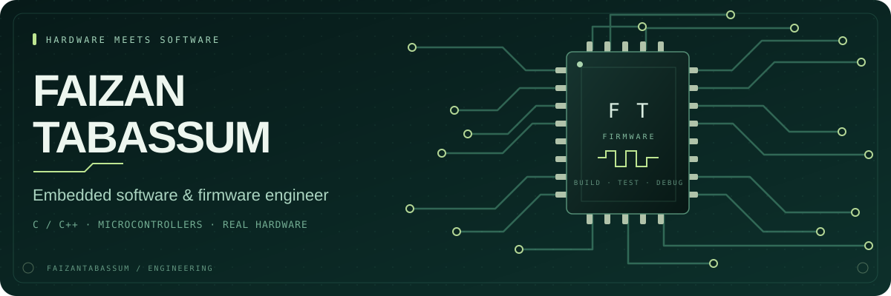

  <strong>Mohamed Faizan Tabassum</strong> 
  MSc Computer Engineering · National University of Singapore  
  <a href="https://www.linkedin.com/in/faizantabassum/">LinkedIn</a>
  &nbsp; · &nbsp;
  <a href="https://github.com/FaizanTabassum?tab=repositories">Explore my repositories</a>

---

### From sensors to working hardware

I build firmware that connects sensors, microcontrollers and real hardware. My experience includes STM32 and Nordic nRF development, peripheral drivers, bootloader debugging, encrypted firmware updates, and testing with oscilloscopes and logic analyzers.

**Graduating January 2028.** Interested in embedded software and firmware roles in **Singapore**, and open to international opportunities and relocation.

### Engineering experience

**PRAD**  
Industrial gas-detector firmware, STM32/nRF prototyping, NFC-V communication, firmware updates, bootloader work, and build/test workflows.

**CheckAg**  
Cortex-M spectrometry firmware, CCD and peripheral drivers, and hardware debugging.

### On my workbench

**Languages** &nbsp; `C` `C++` `Python`  
**Platforms** &nbsp; `STM32` `Nordic nRF` `ESP32` `Arduino`  
**Development & testing** &nbsp; `Git` `Ceedling` `Oscilloscopes` `Logic analyzers`

---

  Building at the intersection of code and circuits.

